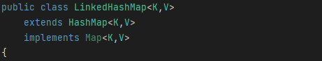
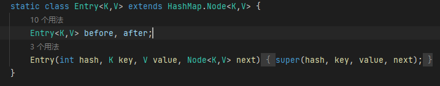

### 1、LRC缓存可以基于LinkedHashMap实现[一般面试官要求不能使用这种方法实现]

利用了LinkedHashMap的特性：连接顺序就是插入顺序

```
class LRUCache {

    private int capacity;
    private LinkedHashMap<Integer,Integer> map=new LinkedHashMap<>();

    public LRUCache(int capacity) {
        this.capacity=capacity;
    }
    
    public int get(int key) {
        Integer value=map.remove(key);
        // 不存在
        if(value==null){
            return -1;
        }
        else{
            map.put(key,value);
            return value;
        }
    }
    
    public void put(int key, int value) {
        // 如果存在则删除
        if(map.remove(key)!=null){
            map.put(key,value);
        }

        // 不存在
        else{
            // 如果超出则删除最老的
            if(map.size()==capacity){
                Integer tempkey=map.entrySet().iterator().next().getKey();
                map.remove(tempkey);
            }
            map.put(key,value);
        }
    }
}

/**
 * Your LRUCache object will be instantiated and called as such:
 * LRUCache obj = new LRUCache(capacity);
 * int param_1 = obj.get(key);
 * obj.put(key,value);
 */
```

### 2、基于源码实现

通过哈希表辅以双向链表实现，我们用一个哈希表和一个双向链表维护所有在缓存中的键值对
即对于Entry中的值存放一个双链表节点 key不变 这样就实现了插入原始前后相连。


源码分析：







可以看出LinkedHashMap：基于HashMap和双链表作为节点实现的
```
package com.lanjie.leecode.topOneHundred;

import java.util.HashMap;

/**
 * @author Mr.Lan
 * @version 1.0
 * @ClassName LRC$
 * @description LRUcache cache 基于HashMap列表  双链表作为节点，并增加了 capicity head tail 《头插法 尾部删除》
 * @date 2025/4/8 20:55
 **/
public class LRUCache {
    public static void main(String[] args) {
        LRUCache lruCache = new LRUCache(3);
        lruCache.put(1,1);
        lruCache.put(2,2);
        lruCache.put(3,3);
        lruCache.put(4,4);
        lruCache.get(2);
        lruCache.put(5,5);
        for (Node value : lruCache.cache.values()) {
            System.out.println(value.value);
        }

    }
    class Node{
        int key;
        int value;
        Node pre;
        Node next;
        public Node(int key,int value){
            this.key=key;
            this.value=value;
        }

        public Node(){
        }
    }
    int capicity;
    int size;
    HashMap<Integer,Node> cache;
    Node head;
    Node tail;

    public LRUCache(int capicity){
        this.capicity=capicity;
        cache=new HashMap<>();
        head=new Node();
        tail=new Node();
        tail.pre=head;
        head.next=tail;
    }


    public int get(int key) {
        Node cur=cache.get(key);
        // 不存在
        if(cur==null){
            return -1;
        }
        // 存在
        movetohead(cur);
        return cur.value;
    }


    void movetohead(Node cur){
        // 修改链表连接
        cur.next.pre=cur.pre;
        cur.pre.next=cur.next;
        // 插入到头部并修改cur连接
        cur.pre=head;
        cur.next=head.next;
        head.next.pre=cur;
        head.next=cur;
    }

    public void put(int key, int value) {
        Node cur=cache.get(key);
        // 不存在 直接头插
        if(cur==null){
            Node newNode=new Node(key,value);
            newNode.next=head.next;
            newNode.pre=head;
            head.next.pre=newNode;
            head.next=newNode;
            cache.put(key,newNode);
            size++;
            if(size>capicity){
                // 删除链表连接
                Node deleteNode=tail.pre;
                tail.pre.pre.next=tail;
                tail.pre=tail.pre.pre;
                // 删除节点
                cache.remove(deleteNode.key);
                size--;
            }
        }
        // 存在直接更新并移到头部
        else{
            movetohead(cur);
            cur.value=value;
        }

    }

}


```