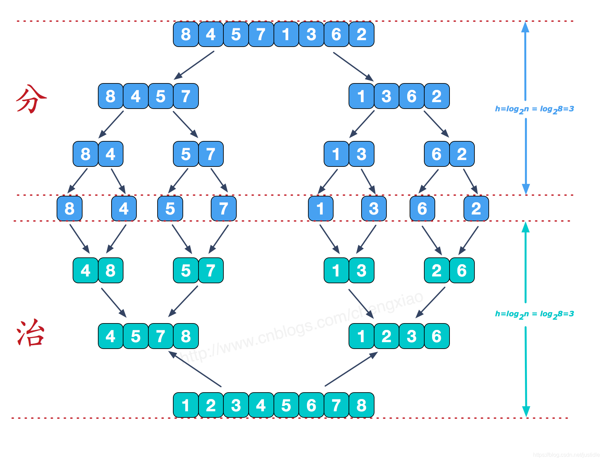

# 排序算法 
### 1、快速排序算法
思路：
1、每次确定最后一个元素在数组中的位置 然后将数组切分成两块
2、重复上述过程
3、时间复杂度：递归层数O(logn)
4、空间复杂度：每次递归使用了局部变量【递归结束才释放】 O(logn)


```
import java.util.Scanner;

/**
 * @author Mr.Lan
 * @version 1.0
 * @ClassName QuickSort$
 * @description 快速排序
 * @time O(nlogn)
 * @space O(logn)
 * @date 2025/4/8 10:50
 **/
public class QuickSort {
    public static void main(String[] args){
        Scanner in =new Scanner(System.in);
        int n=in.nextInt();
        int[] nums=new int[n];
//        输入
        for (int i = 0; i < n; i++) {
            nums[i]=in.nextInt();
        }
//        快排
        quickSort(nums,0,n-1);
//        输出
        System.out.println("归并排序结果：");
        for (int i = 0; i < n-1; i++) {
            System.out.print(nums[i]+" ");
        }
        System.out.println(nums[n-1]);
    }


//      分割+排序（合并）
    static void quickSort(int[] nums,int l,int r){
        if(l>=r)
            return;
//      支点 pivot
        int pivot=nums[r];
        int i=l-1;
        for(int j=l;j<r;j++){
//            i及左边的数均小于等于pivot
            if(nums[j]<pivot){
                i++;
                int temp = nums[i];
                nums[i] = nums[j];
                nums[j] = temp;
            }
        }
//        最后确定pivot的位置 i（包括i）都小于pivot 交换p
        int temp=nums[i+1];
        nums[i+1]=nums[r];
        nums[r]=temp;
        quickSort(nums,l,i);
        quickSort(nums,i+2,r);
    }


}

```


### 2、冒牌排序
思路：
1、从前往后依次交换 保证最大元素在最后
2、最后确定的元素不再比较
3、设置提前出口 保证有序不交换情况下 提前结束
4、时间复杂度O(n^2)
5、空间复杂度O(1) 使用的局部变量每次释放了
```
import java.util.Scanner;

/**
 * @author Mr.Lan
 * @version 1.0
 * @ClassName BubbleSort$
 * @description 冒泡排序(从小到大)
 * @time O(n^2) 最好情况下O(n)
 * @space O(1)
 * @date 2025/4/8 10:51
 **/
public class BubbleSort {
    public static void main(String[] args) {
        Scanner in =new Scanner(System.in);
        int n=in.nextInt();
        int[] nums=new int[n];
        // 输入
        for (int i = 0; i < n; i++) {
            nums[i]=in.nextInt();
        }
        //冒泡排序
        bubbleSort(nums);
        //输出
        System.out.println("冒泡排序结果：");
        for (int i = 0; i < n-1; i++) {
            System.out.print(nums[i]+" ");
        }
        System.out.println(nums[n-1]);
    }

    private static void bubbleSort(int[] nums) {
        for(int i=0;i<nums.length;i++){
//          提前结束标识 当已排序直接结束、优化算法
            boolean swap=false;
            for(int j=1;j<nums.length-i;j++){
                if(nums[j]<nums[j-1]){
                    int temp=nums[j-1];
                    nums[j-1]=nums[j];
                    nums[j]=temp;
                    swap=true;
                }
            }
            if(!swap)
                break;
        }
    }
}

```

### 3、归并排序

思路：
1、先分在归并
2、归并使用的是 从左往右比较 每一小块都是有序的（通过图片可以看出）
3、时间复杂度 O(nlogn)
4、空间复杂度 O(n) 每层递归都使用了长度为n的新数组（用完释放）+logn的局部变量 =O(n)
```
/**
 * @author Mr.Lan
 * @version 1.0
 * @ClassName MergeSort$
 * @description 归并排序
 * @time O(nlogn)
 * @space O(n)+O(logn)=O(n)
 * @date 2025/4/8 10:23
 **/

import java.util.*;


class MergeSort{
    public static void main(String[] args){
        Scanner in =new Scanner(System.in);
        int n=in.nextInt();
        int[] nums=new int[n];
//        输入
        for (int i = 0; i < n; i++) {
            nums[i]=in.nextInt();
        }
//        快排
        int[] newNums=mergeSort(nums,0,n-1);
//        输出
        System.out.println("归并排序结果：");
        for (int i = 0; i < n-1; i++) {
            System.out.print(newNums[i]+" ");
        }
        System.out.println(newNums[n-1]);
    }


    static int[] mergeSort(int[] nums,int l,int r){
//        分
        if(l==r)
            return new int[]{nums[l]};
        int mid=(l+r)/2;
        int[] leftArr = mergeSort(nums,l,mid);
        int[] rightArr= mergeSort(nums,mid+1,r);
//        合
       int m=leftArr.length+rightArr.length;
       int[] newNums=new int[m];
       int i=0,j=0,k=0;
       while(i<leftArr.length&&j<rightArr.length){
           newNums[k++]=leftArr[i]<rightArr[j]?leftArr[i++] :rightArr[j++];
       }
       while(i<leftArr.length){
           newNums[k++]=leftArr[i++];
       }
       while(j<rightArr.length){
            newNums[k++]=rightArr[j++];
       }
       return newNums;

    }


}


```
 